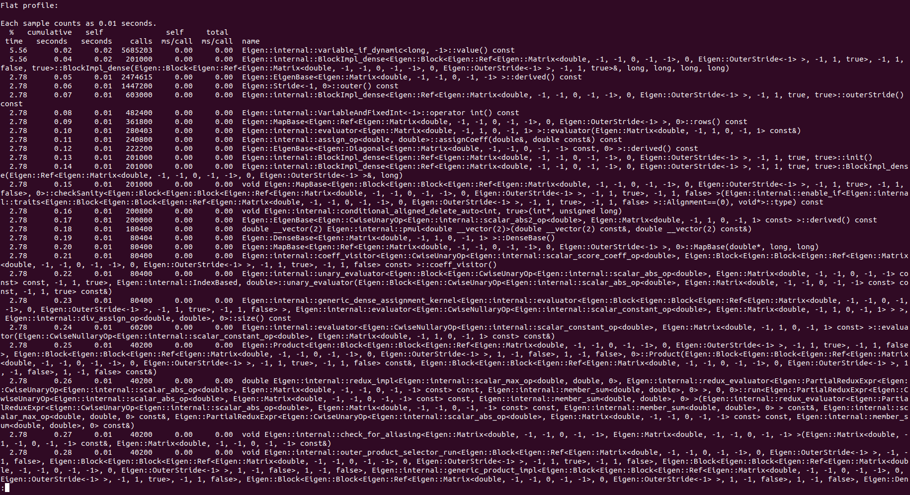

Below is the output from gprof.  

Since eigen-library has been used in our code, most of the output from gprof includes function calls from eigen library. Hence we decided to resort to timing our code using `std::chrono`. 

Since eigen-library is already optimised for linear algebra, we tested our code on Dahlquist test equation for different levels of compiler optimisation. Following are the results from the tests: 

**Without any optimisation**
| Method | Time |
| ------ | ------ |
| Explicit Euler | 2ms |
| RK2 | 7ms |
| RK4 | 25ms|
| Implicit Euler | 1487ms|

**With compiler optimisation -O0**
| Method | Time |
| ------ | ------ |
| Explicit Euler | 1ms |
| RK2 | 1ms |
| RK4 | 6ms|
| Implicit Euler | 362ms|

**With compiler optimisation -O1**
| Method | Time |
| ------ | ------ |
| Explicit Euler | 27us |
| RK2 | 33us |
| RK4 | 180us|
| Implicit Euler | 31.31ms|

**With compiler optimisation -O3**
| Method | Time |
| ------ | ------ |
| Explicit Euler | 23us |
| RK2 | 24us |
| RK4 | 90us|
| Implicit Euler | 24.386ms|

It can be concluded from the timings that compiler optimisations do result in improvement in runtimes.

